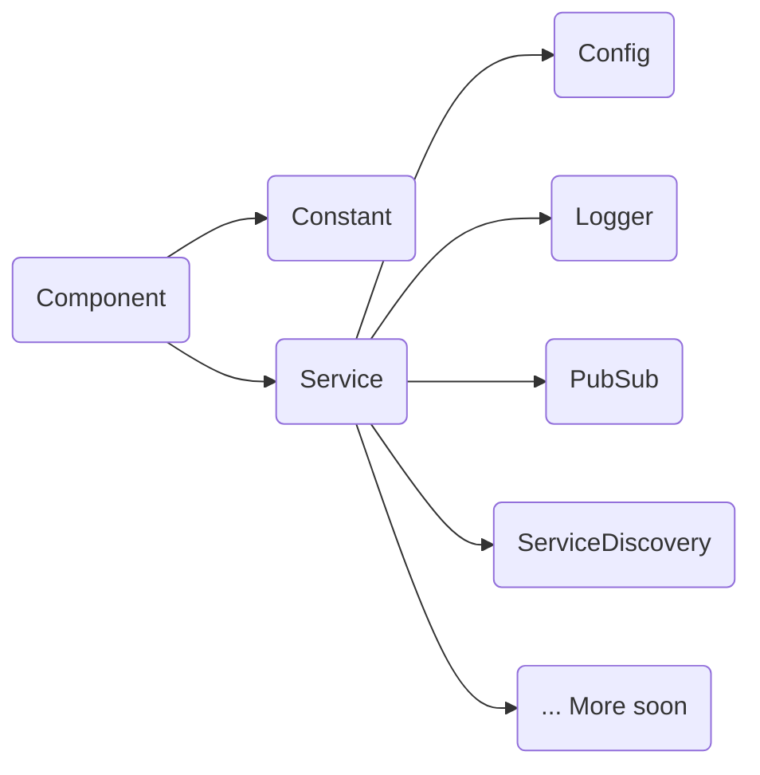

# Microservice - WIP

**Microservice is a framework under development for composing microservices from
instantiated components via dependency injection.**

---

## Installation

Add `Microservice` as a dependency to your `Cargo.toml`:
```toml
[dependencies]

# The main module of Microservice as long as the project stay in development
microservice = { version = "0.1.0", git = "https://github.com/FabriceBazzaro/microservice.git" }

# To use implementations of different modules declared in Microservice, you
# can add the following module
micro_ecosystem =  { version = "0.1.0", git = "https://github.com/FabriceBazzaro/micro_ecosystem.git" }
```

## Usage

The root component, as intended is named `Component` so if you want to create
your own trait from it you can declare it as follow:
```rust
#[injectable(Component)]
trait MyPreciousComponent: Component {
  //...
}
```

In Microservice, a base under development is already defined from the Component
trait.



When you want to provide an implementation of your specific component, the first
step is to indicate the injectable trait implemented:

```rust
#[injectable(MyPreciousComponent)]
struct MyPrecious {
    //...
}
```

And if you want to use the dependency injection, you need to define the `impl`
block with the new function as follow:

```rust
#[injector]
impl MyPrecious {
    #[inject]
    fn new() -> Result<Self> where Self: Sized + 'static {
       //...
    }
}
```

If the object depends on an another one, as a constant for example:
```rust
#[injectable(MyPreciousComponent)]
struct MyPrecious {
    //...
}

#[injector]
impl MyPrecious {
    #[inject]
    fn new(filename_constant: Arc<Mutex<Constant<String, { hash!("CONFIG_FILE") }>>>) -> Result<Self> where Self: Sized + 'static {
        let filename = filename_constant.lock().unwrap().value.clone();
        //...
    }
}
```

Or:
```rust
#[injectable(HorribleComponent)]
struct Gollum {
    //...
}

#[injector]
impl Gollum {
    #[inject]
    fn new(precious: Arc<Mutex<MyPrecious>>) -> Result<Self> where Self: Sized + 'static {
       let my_precious = precious.lock().unwrap();
    }
}
```

# Important

You can express a dependency from a `trait` and not only from a `struct`.
If only one object implements this trait, it will be injected.

```rust
#[injectable(HorribleComponent)]
struct Gollum {
    //...
}

#[injector]
impl Gollum {
    #[inject]
    fn new(precious: Arc<Mutex<dyn MyPreciousComponent>>) -> Result<Self> where Self: Sized + 'static {
       let my_precious = precious.lock().unwrap();
    }
}
```

# Microservice

Once you have defined all your components, you can create your microservice:

```rust
use microservice::share::SimpleUrl;
use microservice::constant::Constant;
use microservice::config::{get_from_config, get_or_from_config};
use microservice::service_discovery::ServiceDiscovery;
use microservice::*;

use micro_ecosystem::config::YamlEnvConfig;
use micro_ecosystem::logger::{PubSubLogger, ConsoleLogger};
use micro_ecosystem::pubsub::NatsPubSub;
use micro_ecosystem::service_discovery::ConsulServiceDiscovery;


#[tokio::main]
async fn main() {
    let mut m: Microservice = Microservice::new();
    m.register_instance(Constant::<String, {hash!("CONFIG_FILE")}>::new("../config.yaml".into()));
    m.register::<YamlEnvConfig>().unwrap();
    m.register::<NatsPubSub>().unwrap();
    m.register::<PubSubLogger>().unwrap();
    let cserv = m.register::<ConsulServiceDiscovery>().unwrap();
    let res = cserv.lock().unwrap().register().await.unwrap();
    //...
```

# Notes

In all the Microservice functions, the Result encapsulate an [Anyhow Error](https://github.com/dtolnay/anyhow)

As long as constants of type &str cannot be used in custom literals in stable
rust the `hash!` macro will be used to declare constants.


## Testing

See the the [tests](tests) directory for tests. Run tests with `cargo test`.

## Contributing

Check out the [issues][1] for items needing attention or submit your own and
then:

1. [Fork][2] the repo
2. Create your feature branch (git checkout -b feature/fooBar)
3. Commit your changes (git commit -am 'Add some fooBar')
4. Push to the branch (git push origin feature/fooBar)
5. Create a new Pull Request

[1]: https://github.com/FabriceBazzaro/microservice/issues
[2]: https://github.com/FabriceBazzaro/microservice/fork